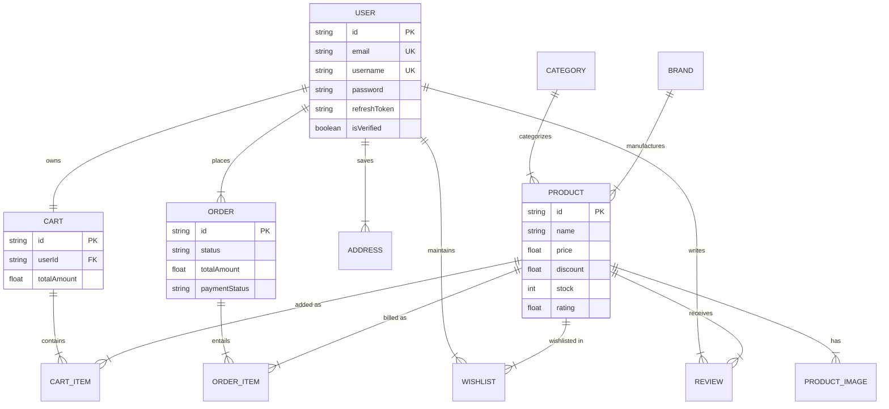
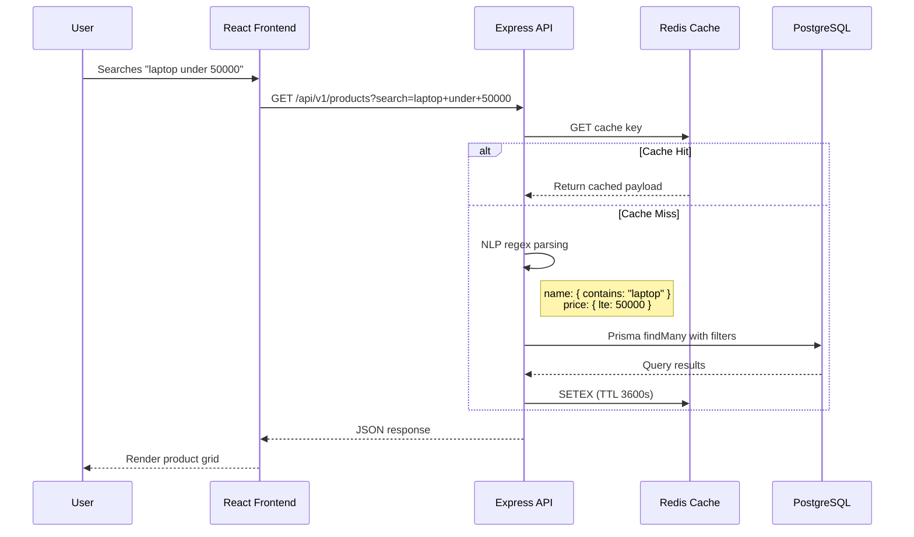
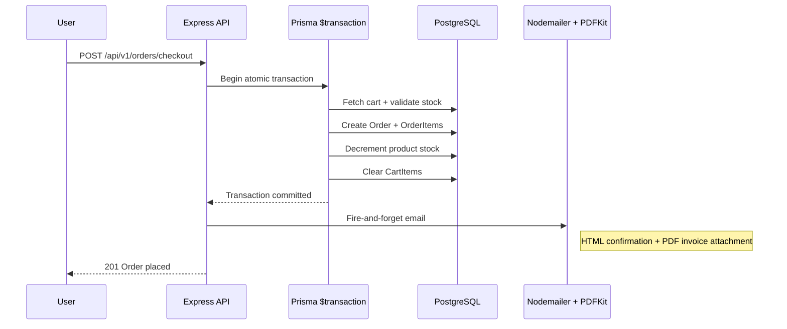

<div align="center">
  
  <h1> ScaleCart</h1>
  <p><strong>A Production-Grade E-Commerce Platform · Flipkart-Inspired Architecture</strong></p>
  
  [](https://scalecart.vercel.app)
  [](https://scalecart.onrender.com/api/v1)
  
  [](https://reactjs.org/)
  [](https://nodejs.org/)
  [](https://www.typescriptlang.org/)
  [](https://supabase.com/)
  [](https://www.prisma.io/)
  [](https://upstash.com/)
</div>

<br />

ScaleCart is a full-stack e-commerce application built to replicate **Flipkart's UI/UX** while implementing **production-grade backend patterns**. The system features a **12-table normalized PostgreSQL schema**, **ACID-compliant transactional checkout**, **Redis cache-aside caching**, **NLP-powered search filtering**, and **real-time PDF invoice generation with email delivery**.

---

## 🌐 Live Demo

> **Frontend:** [https://scalecart.vercel.app](https://scalecart.vercel.app)  
> **Backend API:** [https://scalecart.onrender.com/api/v1](https://scalecart.onrender.com/api/v1)

### Demo Credentials

| Field | Value |
|:---|:---|
| **Email** | `rajputsinghshiv17@gmail.com` |
| **Password** | `1234` |

> [!NOTE]
> Render free-tier backends cold-start after inactivity. The first API call may take ~30s — subsequent requests are instant.

---

## ✨ Key Highlights

| Feature | Implementation |
|:---|:---|
| **Full-Text Search + NLP Parsing** | Native PostgreSQL Full-Text Search (`tsvector`, `ts_rank`) is combined with NLP regex parsing. Queries like _"laptops under 50000"_ are converted into Ranked FTS matches + Prisma range filters (`price: { lte: 50000 }`) — providing ElasticSearch-like capabilities with zero extra infrastructure overhead. |
| **Atomic Checkout** | Order placement uses `prisma.$transaction()` — stock validation, order creation, inventory decrement, and cart clearing all execute atomically. If any step fails, everything rolls back. |
| **Cache-Aside Pattern** | Product reads hit Redis first (TTL: 30min–1hr). On cache miss, PostgreSQL is queried and the result is cached. Write operations (order placement, product updates) invalidate relevant cache keys. |
| **PDF Invoice Generation** | Server-side PDF invoices are generated using `pdfkit` and attached to confirmation emails via Nodemailer (Gmail SMTP). |
| **Secure Price Computation** | Cart prices are computed server-side from the Product table — the client cannot inject manipulated prices. Discounted price = `price - (price × discount / 100)`. |
| **12-Table Relational Schema** | Fully normalized PostgreSQL schema: User, Product, ProductImage, Category, Brand, Cart, CartItem, Order, OrderItem, Address, Review, Wishlist. |

---

## 🏗️ System Architecture

### Entity Relationship Diagram



### Request Flow — Search with Caching



### Checkout Transaction Flow



---

## 🛠️ Technology Stack

| Layer | Technology | Purpose |
|:---|:---|:---|
| **Frontend** | React 19, Vite, TailwindCSS | SPA with Flipkart-inspired UI, responsive 2→5 column product grid, banner carousel |
| **Backend** | Node.js, Express, TypeScript | Type-safe REST API with layered architecture (Routes → Controllers → Middleware → Utils) |
| **Database** | PostgreSQL (Supabase) | 12-table normalized schema with referential integrity and cascading deletes |
| **ORM** | Prisma | Type-safe queries, migrations, atomic transactions, relation management |
| **Caching** | Redis (Upstash) | Cache-aside pattern for product/category reads with intelligent invalidation |
| **Auth** | JWT (HTTP-Only Cookies) | Access + Refresh token strategy with `sameSite: none` for cross-domain deployment |
| **File Storage** | Cloudinary + Multer | Image upload pipeline — Multer handles multipart, Cloudinary stores/serves media |
| **Email** | Nodemailer (Gmail SMTP) | Transactional emails — welcome email on registration, order confirmation with PDF invoice |
| **Payments** | Razorpay (test mode) | Payment gateway integration for order processing |
| **State** | React Context API | Client-side cart and wishlist state synchronized with backend |

---

## 📁 Project Structure

```
scalecart/
├── backend/
│   ├── prisma/
│   │   ├── schema.prisma          # 12-model PostgreSQL schema
│   │   └── seed.ts                # Seeds 100 products from DummyJSON API
│   ├── src/
│   │   ├── controllers/           # Business logic (11 controllers)
│   │   │   ├── user.controllers.ts
│   │   │   ├── product.controllers.ts
│   │   │   ├── cart.controllers.ts
│   │   │   ├── order.controllers.ts
│   │   │   ├── wishlist.controllers.ts
│   │   │   ├── payment.controllers.ts
│   │   │   └── ...
│   │   ├── middlewares/
│   │   │   ├── auth.middlewares.ts # JWT verification (cookie + Bearer)
│   │   │   └── multer.middlewares.ts
│   │   ├── routes/                # Express route definitions (11 files)
│   │   ├── utils/
│   │   │   ├── redis.ts           # Cache-aside helpers
│   │   │   ├── sendEmail.ts       # Email + PDF invoice generation
│   │   │   ├── cloudinary.ts      # Image upload utility
│   │   │   ├── apiError.ts        # Custom error class
│   │   │   ├── apiResponse.ts     # Standardized response wrapper
│   │   │   └── asyncHandler.ts    # Express async error wrapper
│   │   ├── app.ts                 # Express app config (CORS, routes, error handler)
│   │   └── index.ts               # Server entry point
│   ├── .env.example
│   └── package.json
│
├── frontend/
│   ├── src/
│   │   ├── components/
│   │   │   ├── Navbar.jsx         # Flipkart-style header with category dropdowns
│   │   │   ├── ProductCard.jsx    # Product tile with wishlist toggle
│   │   │   ├── AuthModal.jsx      # Login/Register modal
│   │   │   └── Loader.jsx         # Skeleton loader
│   │   ├── pages/
│   │   │   ├── Home.jsx           # Banner carousel + product grid + NLP search
│   │   │   ├── ProductDetail.jsx  # Image carousel + stock badge + add to cart
│   │   │   ├── Cart.jsx           # Cart management with quantity controls
│   │   │   ├── Checkout.jsx       # Address selection + order placement
│   │   │   ├── Orders.jsx         # Order history
│   │   │   ├── Wishlist.jsx       # Saved items
│   │   │   ├── Profile.jsx        # User profile + address management
│   │   │   └── OrderSuccess.jsx   # Post-checkout confirmation
│   │   ├── context/
│   │   │   ├── CartContext.jsx     # Cart state + API sync
│   │   │   └── WishlistContext.jsx # Wishlist state + API sync
│   │   ├── services/
│   │   │   └── api.js             # Axios instance with all API calls
│   │   └── App.jsx                # Router + layout
│   ├── .env.production
│   └── package.json
│
└── README.md
```

---

## 🔐 Security & Anti-Fraud Measures

| Measure | Implementation |
|:---|:---|
| **Server-Side Price Enforcement** | `addToCart` controller fetches the product from PostgreSQL and computes `securePrice = price - (price × discount / 100)`. Client-sent prices are ignored. |
| **Race Condition Prevention** | The checkout engine wraps stock validation + decrement inside `prisma.$transaction()`. Two concurrent purchases of the last unit will serialize — the second is rejected with "Insufficient stock". |
| **Token Security** | JWTs are stored in `httpOnly` cookies (inaccessible to JavaScript/XSS). Cross-domain cookie delivery uses `secure: true` + `sameSite: "none"`. |
| **CORS Hardening** | Dynamic origin validation — only `scalecart.vercel.app`, `localhost:5173`, and `*.vercel.app` preview URLs are allowed. No wildcard `*` with credentials. |
| **Input Validation** | Required fields are validated in controllers before any DB operation. Stock bounds are checked before cart additions. |

---

## 🖥️ Local Development Setup

```bash
# 1. Clone the repository
git clone <your-repo-url>
cd scalecart

# 2. Install dependencies
cd backend && npm install
cd ../frontend && npm install

# 3. Configure environment
cp backend/.env.example backend/.env
# Fill in your PostgreSQL, Redis, Cloudinary, and SMTP credentials

# 4. Initialize the database
cd backend
npx prisma generate
npx prisma db push
npx prisma db seed    # Seeds 100 products from DummyJSON API

# 5. Start backend (Terminal 1)
npm run dev            # → http://localhost:8000

# 6. Start frontend (Terminal 2)
cd frontend
npm run dev            # → http://localhost:5173
```

---

## 📊 API Endpoints Overview

| Method | Endpoint | Auth | Description |
|:---|:---|:---|:---|
| `POST` | `/api/v1/users/register` | ✗ | Register new user |
| `POST` | `/api/v1/users/login` | ✗ | Login (sets JWT cookies) |
| `POST` | `/api/v1/users/logout` | ✔ | Logout (clears cookies) |
| `GET` | `/api/v1/users/profile` | ✔ | Get user profile |
| `PUT` | `/api/v1/users/profile` | ✔ | Update profile |
| `GET` | `/api/v1/products` | ✗ | List products (search, filter, pagination) |
| `GET` | `/api/v1/products/:id` | ✗ | Get single product |
| `GET` | `/api/v1/categories/categories` | ✗ | List all categories |
| `GET` | `/api/v1/cart` | ✔ | Get user's cart |
| `POST` | `/api/v1/cart/add` | ✔ | Add item to cart |
| `PUT` | `/api/v1/cart/update` | ✔ | Update cart item quantity |
| `DELETE` | `/api/v1/cart/remove` | ✔ | Remove item from cart |
| `POST` | `/api/v1/orders/checkout` | ✔ | Place order (atomic transaction) |
| `GET` | `/api/v1/orders` | ✔ | Get order history |
| `GET` | `/api/v1/wishlist` | ✔ | Get wishlist |
| `POST` | `/api/v1/wishlist/toggle` | ✔ | Toggle wishlist item |
| `GET` | `/api/v1/users/addresses` | ✔ | List saved addresses |
| `POST` | `/api/v1/users/address` | ✔ | Add new address |

---

<p align="center">
  <strong>Built as a production-grade engineering demonstration of scalable e-commerce systems.</strong>
</p>
