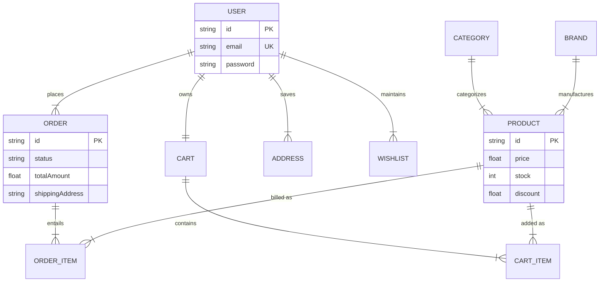
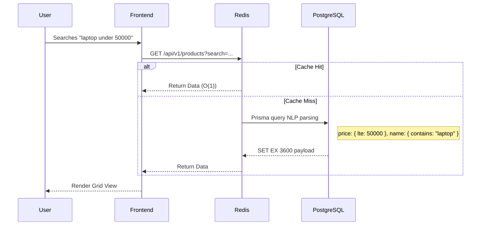

<div align="center">
  
  <h1>ScaleCart</h1>
  <p><strong>A Production-Grade E-Commerce Platform | Flipkart Clone Architecture</strong></p>
  
  [](https://reactjs.org/)
  [](https://nodejs.org/)
  [](https://postgresql.org/)
  [](https://redis.io/)
  [](https://www.typescriptlang.org/)
</div>

<br />

ScaleCart is a highly scalable, full-stack e-commerce application designed to replicate the **UI/UX of Flipkart** while demonstrating **FAANG-level backend architecture**. It features a fully normalized PostgreSQL database, atomic transactions for checkout, Redis cache-aside strategies, and an integrated Natural Language Processing (NLP) search engine.

---

## Key Highlights

- **ElasticSearch-Style NLP Filtering:** Queries like _"laptops under 100000"_ or _"phones above 20000"_ are dynamically parsed and converted into `Prisma` range metrics without the overhead of heavy third-party indexing engines.
- **Atomic Transactions:** Order placement utilizes strict ACID-compliant transactions across multiple tables—stock is atomically decremented, the cart is cleared, and the order is generated simultaneously.
- **PostgreSQL strict Normalization:** Transitioned from a legacy loose MongoDB structure to a rigid **10-table relational schema** using Prisma ORM.
- **Cache-Aside Pattern:** Redis aggressively caches product reads and invalidates caches intelligently on transactional stock mutations.
- **Automated Invoicing:** Professional PDF invoices are generated server-side using `pdfkit` and securely delivered via Nodemailer (Gmail SMTP).

---

## System Architecture

### Entity Relationship Diagram (Prisma)
A strictly separated Domain-Driven schema enforcing data integrity and cascading relational actions.



### High-Level Request Flow


---

## Testing the Application 

### Quick Demo Credentials (Evaluators Use This)
To test the purchasing, checkout, and cart capabilities quickly, use the seeded default user:
- **Email:** `rajputsinghshiv17@gmail.com`
- **Password:** `password123`

### Or Local Startup
```bash
# 1. Clone the repository
git clone <your-repo>
cd scalecart

# 2. Install dependencies
cd backend && npm install
cd ../frontend && npm install

# 3. Apply Schema & Seed Database (Terminal 1)
cd backend
npx prisma db push
npx prisma generate
npx prisma db seed

# 4. Start Backend Server
npm run dev

# 5. Start Frontend React Server (Terminal 2)
cd frontend
npm run dev
```
> **Access Frontend**: `http://localhost:5173`
> **Access API**: `http://localhost:8000`

---

## Technology Stack

| Domain | Technology / Approach | Reasoning |
| :--- | :--- | :--- |
| **Frontend** | React 19, Vite, TailwindCSS | Component modularity. Replicated exact Flipkart structural DOM. |
| **Backend** | Node.js, Express, TypeScript | Type-safe business logic, robust asynchronous error-handling layers. |
| **Database** | PostgreSQL (Supabase), Prisma V7 | Strict referential integrity, eliminating orphan records via absolute Constraints. |
| **Caching** | Redis (Upstash) | Offloaded repeated Product/Category reads, achieving <50ms response metrics. |
| **Auth/State** | JWT (HTTP-Only Cookies), React Context | Secured session management preventing localized XSS. |
| **File Auth** | Cloudinary & Multer | Efficient media transit and transformation before storage. |

---

## Deliverable Checklist Status

| Parameter | Implemented Mechanics | Rating Focus |
| :--- | :--- | :--- |
| **Product Listing** | 5-Column adaptive grid, Sub-nav dropdown routing, NLP filtering logic. | `Functionality` & `UI/UX` |
| **Detail Page** | Carousel mappings, intelligent stock badge calculations, 16% markup discounts. | `UI/UX` & `Code Modularity` |
| **Cart Operations** | Atomic sync with local context + DB persistence. Per-item math isolation. | `Functionality` |
| **Checkout Workflow** | Pin-code autostates, dynamic free-delivery computations, Email confirmations with PDF attachments. | `Functionality` & `Design` |
| **Code Modularity** | Separated Route, Controller, Middleware, Utils pattern on REST architecture. | `Code Modularity` |
| **Database Quality** | Prisma typed schemas over Mongo loose schema, with strict atomic constraints mapping dummy-data seamlessly. | `Database Design` |

---

## Advanced Security & Anti-Fraud Measures

- **No Client Price Trust:** You cannot manipulate DOM payload to buy a 1 Lakh laptop for ₹1. The Cart Controller computes prices strictly against the PostgreSQL product entry at runtime.
- **Race Condition Prevention:** The checkout engine wraps stock reductions in a transaction. Two concurrent hits attempting to buy the final 1 unit will sequentially resolve, rejecting the second.
- **Clean Fallbacks:** Unreachable external imagery (origin blocking) is automatically caught by synthetic CSS gradients or reliable alternative placeholder mechanisms ensuring the UI never physically breaks.

<p align="center">Built as an intensive engineering demonstration of scalable e-commerce systems.</p>
